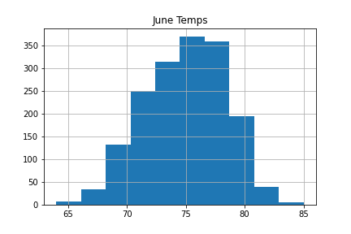
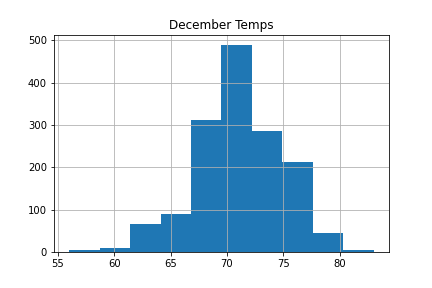

# SurfsUp Backgroud
The stakeholder has requested temperature trends for the months of June and December for Oahu, HI. 

# Overview of the Analysis
The weather was extracted from a SQLite database using sqlalchemy. The database contained two tables: measurement and station. These tables were identified after reflecting the database and tables using automap_base within sqlalchemy. Using Pandas, the tables were transformed into DataFrames and were used to generate the requested summary statistics.

# Findings
## June Weather Summary
- The average temperature is 75°F
- The highest temperature observed was 85°F
- The lowest temperature observed was 64°F

## December Weather Summary
- The average temperature is 71°F
- The highest temperature observed was 83°F
- The lowest temperature observed was 56°F

## Comparison
- The range between average temperatures in June and December is negligible (4°F)
- The overall range of temperatures in June is lower than in December (21°F in June vs 27°F)
- There are fewer data points in December to analyze than in June (1517 in December vs 1700 in June)

# Additional Queries to Consider
- Which locations have are best based on the station data
- What the precipitation is like in June vs December